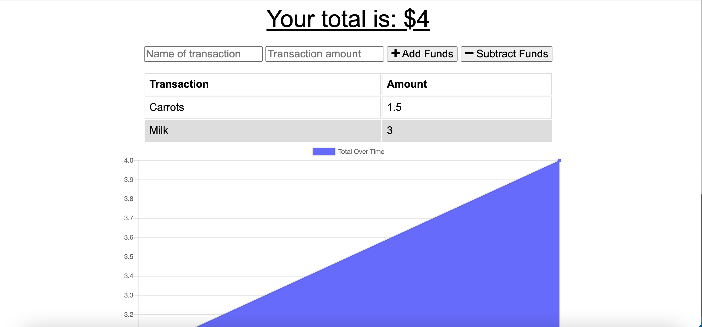

# Budget-tracker

  
  
  #### Table of Contents
  * [Project Description](#project-description)
  * [Installation Instructions](#installation-instructions)
  * [Test Instructions](#test-instructions)
  * [Screenshots](#screenshots)
  * [Usage Guidelines](#usage-guidelines)
  * [License](#license)
  * [Contribution Guidelines](#contribution-guidelines)
  * [Questions](#questions)

  ## Project Description 
  Track your budget online and offline! 
  Add expenses even when the user is offline. Expenses added while offline can still be found once the app is back online. 

  ## Installation Instructions
  * npm install

  ## Test Instructions
  * npm start

  ## Screenshots
  

  ## Usage Guidelines
  * To see deployed app:
  (https://hidden-castle-02261.herokuapp.com)

  ## Credits
  * smj3085

  ## Contribution Guidelines
  * All contributions welcome! 

  

  ## Questions
  If you have any questions about the repo, contact me directly at stephaniemjlee@gmail.com.  
  You can find more of my work at [smj3085](http://github.com/smj3085).